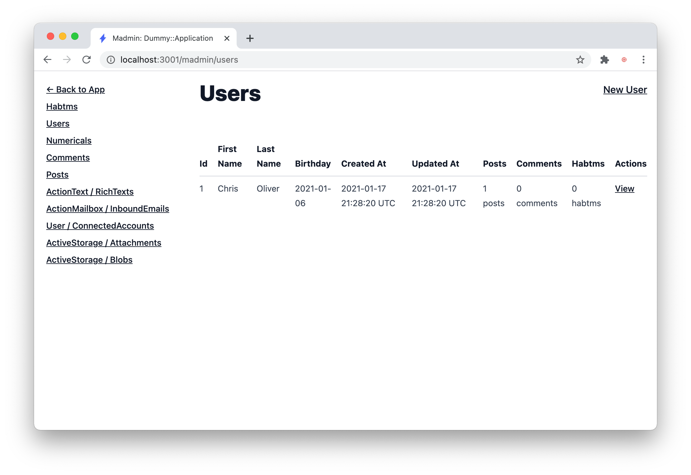

# Elasticsearch Rails

[](https://github.com/elastic/elasticsearch-rails/actions/workflows/tests.yml)
[](https://github.com/elastic/elasticsearch-rails/actions/workflows/jruby.yml)

This repository contains various Ruby and Rails integrations for [Elasticsearch](http://elasticsearch.org):

* ActiveModel integration with adapters for ActiveRecord and Mongoid
* _Repository pattern_ based persistence layer for Ruby objects
* Enumerable-based wrapper for search results
* ActiveRecord::Relation-based wrapper for returning search results as records
* Convenience model methods such as `search`, `mapping`, `import`, etc
* Rake tasks for importing the data
* Support for Kaminari and WillPaginate pagination
* Integration with Rails' instrumentation framework
* Templates for generating example Rails application

Elasticsearch client and Ruby API is provided by the
**[elasticsearch-ruby](https://github.com/elastic/elasticsearch-ruby)** project.

## Installation

Install each library from [Rubygems](https://rubygems.org/gems/elasticsearch):

    gem install elasticsearch-model
    gem install elasticsearch-rails

## Compatibility

The libraries are compatible with Ruby 3.0 and higher.

We follow Ruby’s own maintenance policy and officially support all currently maintained versions per [Ruby Maintenance Branches](https://www.ruby-lang.org/en/downloads/branches/).

The version numbers follow the Elasticsearch major versions. Currently the `main` branch is compatible with version `8.x` of the Elasticsearch stack.

| Rubygem       |   | Elasticsearch |
|:-------------:|:-:| :-----------: |
| 0.1           | → | 1.x           |
| 2.x           | → | 2.x           |
| 5.x           | → | 5.x           |
| 6.x           | → | 6.x           |
| 7.x           | → | 7.x           |
| 8.x           | → | 8.x           |
| main          | → | 8.x           |

Check out [Elastic product end of life dates](https://www.elastic.co/support/eol) to learn which releases are still actively supported and tested.

## Usage

This project is split into three separate gems:

* [**`elasticsearch-model`**](https://github.com/elastic/elasticsearch-rails/tree/main/elasticsearch-model),
  which contains search integration for Ruby/Rails models such as ActiveRecord::Base and Mongoid,

* [**`elasticsearch-persistence`**](https://github.com/elastic/elasticsearch-rails/tree/main/elasticsearch-persistence),
  which provides a standalone persistence layer for Ruby/Rails objects and models

* [**`elasticsearch-rails`**](https://github.com/elastic/elasticsearch-rails/tree/main/elasticsearch-rails),
  which contains various features for Ruby on Rails applications

Example of a basic integration into an ActiveRecord-based model:

```ruby
require 'elasticsearch/model'

class Article < ActiveRecord::Base
  include Elasticsearch::Model
  include Elasticsearch::Model::Callbacks
end

# Index creation right at import time is not encouraged.
# Typically, you would call create_index! asynchronously (e.g. in a cron job)
# However, we are adding it here so that this usage example can run correctly.
Article.__elasticsearch__.create_index!
Article.import

@articles = Article.search('foobar').records
```

You can generate a simple Ruby on Rails application with a single command
(see the [other available templates](https://github.com/elastic/elasticsearch-rails/tree/main/elasticsearch-rails#rails-application-templates)). You'll need to have an Elasticsearch cluster running on your system before generating the app. The easiest way of getting this set up is by running it with Docker with this command:

```bash
  docker run \
    --name elasticsearch-rails-searchapp \
    --publish 9200:9200 \
    --env "discovery.type=single-node" \
    --env "cluster.name=elasticsearch-rails" \
    --env "cluster.routing.allocation.disk.threshold_enabled=false" \
    --rm \
    docker.elastic.co/elasticsearch/elasticsearch:7.6.0
```

Once Elasticsearch is running, you can generate the simple app with this command:

```bash
rails new searchapp --skip --skip-bundle --template https://raw.github.com/elasticsearch/elasticsearch-rails/main/elasticsearch-rails/lib/rails/templates/01-basic.rb
```

Example of using Elasticsearch as a repository for a Ruby domain object:

```ruby
class Article
  attr_accessor :title
end

require 'elasticsearch/persistence'
repository = Elasticsearch::Persistence::Repository.new

repository.save Article.new(title: 'Test')
# POST http://localhost:9200/repository/article
# => {"_index"=>"repository", "_id"=>"Ak75E0U9Q96T5Y999_39NA", ...}
```

**Please refer to each library documentation for detailed information and examples.**

### Model

* [[README]](https://github.com/elastic/elasticsearch-rails/blob/main/elasticsearch-model/README.md)
* [[Documentation]](http://rubydoc.info/gems/elasticsearch-model/)
* [[Test Suite]](https://github.com/elastic/elasticsearch-rails/tree/main/elasticsearch-model/spec/elasticsearch/model)

### Persistence

* [[README]](https://github.com/elastic/elasticsearch-rails/blob/main/elasticsearch-persistence/README.md)
* [[Documentation]](http://rubydoc.info/gems/elasticsearch-persistence/)
* [[Test Suite]](https://github.com/elastic/elasticsearch-rails/tree/main/elasticsearch-persistence/spec)

### Rails

* [[README]](https://github.com/elastic/elasticsearch-rails/blob/main/elasticsearch-rails/README.md)
* [[Documentation]](http://rubydoc.info/gems/elasticsearch-rails)
* [[Test Suite]](https://github.com/elastic/elasticsearch-rails/tree/main/elasticsearch-rails/spec)

## Development

To work on the code, clone the repository and install all dependencies first:

```
git clone https://github.com/elastic/elasticsearch-rails.git
cd elasticsearch-rails/
bundle install
rake bundle:install
```

### Running the Test Suite

You can run unit and integration tests for each sub-project by running the respective Rake tasks in their folders.

You can also unit, integration, or both tests for all sub-projects from the top-level directory:

    rake test:all

The test suite expects an Elasticsearch cluster running on port 9250, and **will delete all the data**.

## License

This software is licensed under the Apache 2 license, quoted below.

    Licensed to Elasticsearch B.V. under one or more contributor
    license agreements. See the NOTICE file distributed with
    this work for additional information regarding copyright
    ownership. Elasticsearch B.V. licenses this file to you under
    the Apache License, Version 2.0 (the "License"); you may
    not use this file except in compliance with the License.
    You may obtain a copy of the License at

    	http://www.apache.org/licenses/LICENSE-2.0

    Unless required by applicable law or agreed to in writing,
    software distributed under the License is distributed on an
    "AS IS" BASIS, WITHOUT WARRANTIES OR CONDITIONS OF ANY
    KIND, either express or implied.  See the License for the
    specific language governing permissions and limitations
    under the License.


# Hatchbox.io Deploy Action

Trigger Hatchbox.io app deployments.

For Hatchbox Classic users, see [v1]().

#### Inputs

Use these inputs to customise the action.

Input Name | Default | Required? | Description
------------ | ------------- | ------------ | -------------
deploy_key | N/A | Y | Your Hatchbox.io app's Deploy Key.
sha | ${{ github.sha }} | N | The commit sha to deploy. Default's to the sha that triggered the GitHub Action.

## Usage

Set `HATCHBOX_DEPLOY_KEY` in your GitHub Secrets. You can find the Deploy Key in the URL on the App's Repository tab in Hatchbox.io.

#### Example

```yaml
# .github/workflows/deploy.yml
on:
  push:
    branches:
      - main

jobs:
  build:
    runs-on: ubuntu-latest
    steps:
    - uses: actions/checkout@v4
    - uses: hatchboxio/github-hatchbox-deploy-action@v2
      with:
        deploy_key: ${{ secrets.HATCHBOX_DEPLOY_KEY }}
```


# // https://github.com/hotwired/turbo/blob/main/src/core/drive/visit.ts#L56-L60
# Madmin
### 🛠 A robust Admin Interface for Ruby on Rails apps

[](https://github.com/excid3/madmin/actions) [](https://badge.fury.io/rb/madmin)

Why another Ruby on Rails admin? We wanted an admin that was:

* Familiar and customizable like Rails scaffolds (less DSL)
* Supports all the Rails features out of the box (ActionText, ActionMailbox, has_secure_password, etc)
* Stimulus / Turbolinks / Hotwire ready


_We're still working on the design!_

## Installation
Add `madmin` to your application's Gemfile:

```bash
bundle add madmin
```

Then run the madmin generator:

```bash
rails g madmin:install
```

This will install Madmin and generate resources for each of the models it finds.

## Resources

Madmin uses `Resource` classes to add models to the admin area.

### Generate a Resource

To generate a resource for a model, you can run:

```bash
rails g madmin:resource ActionText::RichText
```

## Configuring Views

The views packaged within the gem are a great starting point, but inevitably people will need to be able to customize those views.

You can use the included generator to create the appropriate view files, which can then be customized.

For example, running the following will copy over all of the views into your application that will be used for every resource:
```bash
rails generate madmin:views
```

The view files that are copied over in this case includes all of the standard Rails action views (index, new, edit, show, and _form), as well as:
* `application.html.erb` (layout file)
* `_javascript.html.erb` (default JavaScript setup)
* `_navigation.html.erb` (renders the navigation/sidebar menu)

As with the other views, you can specifically run the views generator for only the navigation or application layout views:
```bash
rails g madmin:views:navigation
 # -> app/views/madmin/_navigation.html.erb

rails g madmin:views:layout  # Note the layout generator includes the layout, javascript, and navigation files.
 # -> app/views/madmin/application.html.erb
 # -> app/views/madmin/_javascript.html.erb
 # -> app/views/madmin/_navigation.html.erb
```

If you only need to customize specific views, you can restrict which views are copied by the generator:
```bash
rails g madmin:views:index
 # -> app/views/madmin/application/index.html.erb
```

You might want to make some of your model's attributes visible in some views but invisible in others.
The `attribute` method in model_resource.rb gives you that flexibility.

```bash
 # -> app/madmin/resources/book_resource.rb
```
```ruby
class UserResource < Madmin::Resource
  attribute :id, form: false
  attribute :tile
  attribute :subtitle, index: false
  attribute :author
  attribute :genre
  attribute :pages, show: false
end
```

You can also scope the copied view(s) to a specific Resource/Model:
```bash
rails generate madmin:views:index Book
 # -> app/views/madmin/books/index.html.erb
```

## Custom Fields

You can generate a custom field with:

```bash
rails g madmin:field Custom
```

This will create a `CustomField` class in `app/madmin/fields/custom_field.rb`
And the related views:

```bash
# -> app/views/madmin/fields/custom_field/_form.html.erb
# -> app/views/madmin/fields/custom_field/_index.html.erb
# -> app/views/madmin/fields/custom_field/_show.html.erb
```

You can then use this field on our resource:

```ruby
class PostResource < Madmin::Resource
  attribute :title, field: CustomField
end
```

## Authentication

You can use a couple of strategies to authenticate users who are trying to
access your madmin panel: [Authentication Docs](docs/authentication.md)

## 🙏 Contributing

This project uses Standard for formatting Ruby code. Please make sure to run standardrb before submitting pull requests.

## 📝 License
The gem is available as open source under the terms of the [MIT License](https://opensource.org/licenses/MIT).
